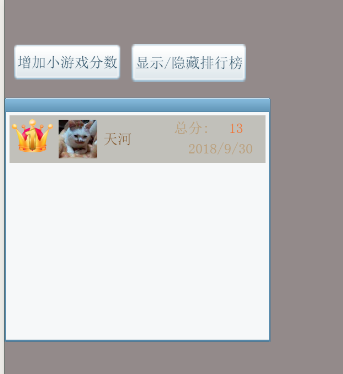

# laya-wx-rank-ts
Layabox(windows版本，因为没钱买苹果)开发的微信小游戏排行榜demo，使用开放数据域，开发用的Typescript语言，对应Laya类库版本为1.7.19

# 使用步骤
为了同时使用版本管理和图集加载，做了一些特殊的处理，具体原理会在下一小节说明，这里请先照着用吧:)。
1. 下载本项目解压，可以看到三个文件夹,main为主代码，open-data为开放数据域代码，wxgame对应最后发布出来的小游戏代码（现在是空的，等这些步骤执行完，它就有东西了)。
2. 在两个Layabox窗口中分别打开main项目和open-data项目。
3. 在两个项目中都切换到编辑模式，按F12导出资源。
4. 执行main项目下的copy.bat脚本，将排行榜图集拷贝到单独的文件夹下。
5. main项目切换回代码模式，编译，然后发布项目。这里是重点，发布项目的选项，要勾选启用版本管理，后续执行脚本要选择main项目下的release.bat文件。然后就能看到与main平级的wxgame文件夹下有内容了。
6. 继续发布open-data项目，注意，发布选项，*不要*勾选版本管理，后续执行脚本选择open-data项目下的release_opendata文件。
7. 用微信web开发者工具打开wxgame文件夹，填入你自己的小游戏AppID，即可执行看到效果了。

界面比较丑，请忽略


# 代码说明
### 基础实现
这个其实在社区里有不少文章说过了，但是在这里我还是重复讲一遍吧。
首先，大家都知道肯定是需要两个项目的，一个对应小游戏的主域，另一个对应小游戏的开放数据域（子域）。
main文件夹，对应主域，初始化的时候用 <code>Laya.MiniAdpter.init(true, false);</code>，表示是主域，并自动将加载的文本数据自动传递到子域。
而open-data对应子域，初始化时用 <code>Laya.MiniAdpter.init(true, true);;</code>，其实我觉得第一个参数没啥用，关键是第二个参数表示它是子域。

---
在主域中，做了以下几件事：
* 设置共享画布，根据小游戏的文档，它的宽高只能在主域设置，不能在开放数据域中设置，我这里使用了如下的代码：
```
let wx = Laya.Browser.window.wx;
Laya.timer.once(1000, this, () => {
    //设置共享画布大小
    let sharedCanvas = wx.getOpenDataContext().canvas;
    sharedCanvas.width = Laya.stage.width;
    sharedCanvas.height = Laya.stage.height;
    //主域往子域透传消息
    wx.postMessage({type:"resizeShared",url:"",data:{width:Laya.stage.width,height:Laya.stage.height,matrix:Laya.stage._canvasTransform},isLoad:false});
    Laya.ResourceVersion.type = Laya.ResourceVersion.FILENAME_VERSION;
    Laya.ResourceVersion.enable("version.json", Laya.Handler.create(this, this.loadOpenDataResource));
});
```
* 绘制离屏画布，我在这里是把它放在了页面里，首先创建了一个Sprite组件，并设置它的var为openDataCanvas，然后，在View初始化时使用如下代码：
```
let texture:Laya.Texture = new Laya.Texture(Laya.Browser.window.sharedCanvas);
texture.bitmap.alwaysChange = true;//小程序使用，非常费，这个参数可以根据自己的需求适当调整，如果内容不变可以不用设置成true
this.openDataCanvas.graphics.drawTexture(texture, 0, 0, texture.width, texture.height);
```
* 控制离屏画布的显示和隐藏，有了上面的openDataCanvas，直接设置它的visible属性就好。然后在显示的同时，向子域发送刷新数据的命令（参考下方子域接收命令的说明），以下是部分代码：
```
protected postMessage(item:Object):void
{
    if (Laya.Browser.onMiniGame) {
        let wx = Laya.Browser.window.wx;
        let openDataContext = wx.getOpenDataContext();
        openDataContext.postMessage(item);
    }
}

public showRankList():void
{
    this.rankBox.x = -480;
    this.openDataCanvas.x = -471;
    this.rankBox.visible = true;
    this.openDataCanvas.visible = true;

    Laya.Tween.to(this.rankBox, {"x": 0}, 200);
    Laya.Tween.to(this.openDataCanvas, {"x": 0}, 200);

    this.postMessage({
        cmd: 'showRank',
    });
}
```

---
在子域中，做了以下几件事：
* 

### 版本管理&图集使用